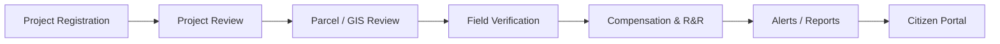

# Samanvaya

> Land Acquisition Monitoring Portal for project review, parcel tracking, compensation workflows, and citizen-facing updates.

## Overview

This repository contains a React + Vite front-end for a land acquisition monitoring platform. The app models a public-sector workflow around government acquisition projects, affected parcels, field verification, compensation, and citizen communication.

The current implementation is a front-end prototype/demo built around structured mock data in `src/data/mockData.js`. It is not a production backend application and does not currently include a live API, authentication layer, or persisted database.

## Why this exists

Land acquisition work involves many stakeholders with different responsibilities:

- national or ministry officers tracking program progress
- state and district officers reviewing project approval and compliance
- field officers capturing parcel verification inputs
- landowners and citizens checking status, objections, and compensation updates
- project teams managing workflow, documents, and reporting

This app brings those responsibilities into a single dashboard-driven interface so the process can be reviewed and discussed in one place.

## The user journey



## What is implemented

The repository includes a role-based portal with multiple sections:

- Dashboard landing screens for different government roles
- Project registration and project review workflows
- Individual project detail pages with status, timelines, and parcel context
- Parcel list and parcel detail views
- GIS map page using Leaflet for project and parcel context
- Workflow monitoring pages
- Compensation and R&R tracking views
- Field verification pages and report capture
- Alerts, documents, and reports views
- Citizen-facing portal for landowner information and updates

## Roles represented in the UI

The app includes role-specific access patterns for:

- National / Ministry Officer
- State Officer
- District / CALA Officer
- Land Requiring Body (LRB)
- Field Officer / Agent
- Citizen / Landowner
- System Administrator

These roles are defined in the mock data layer and used to determine which pages and navigation entries are available.

## Tech stack

The repo currently uses:

- React 19
- Vite
- React Router
- Leaflet + react-leaflet for map rendering
- Recharts for charts and KPI-style visualizations
- Lucide React for icons
- CSS-based UI styling in the app source

## Repository structure

```text
.
├── src/
│   ├── App.jsx
│   ├── App.css
│   ├── data/
│   │   └── mockData.js
│   ├── pages/
│   │   ├── Alerts.jsx
│   │   ├── AffectedParcels.jsx
│   │   ├── CitizenPortal.jsx
│   │   ├── Compensation.jsx
│   │   ├── Documents.jsx
│   │   ├── FieldVerification.jsx
│   │   ├── GISMap.jsx
│   │   ├── LandAcquisitionDashboard.jsx
│   │   ├── Login.jsx
│   │   ├── ParcelDetails.jsx
│   │   ├── Parcels.jsx
│   │   ├── ProjectDetails.jsx
│   │   ├── Projects.jsx
│   │   ├── Reports.jsx
│   │   ├── RnR.jsx
│   │   └── Workflow.jsx
│   ├── utils/
│   ├── index.css
│   └── main.jsx
├── public/
├── index.html
├── package.json
├── vite.config.js
├── eslint.config.js
└── README.md
```

## Data model and behavior

The application does not depend on a backend service in this repository. Instead:

- navigation and permissions are driven by mock role metadata
- project records, parcel records, alerts, and user profiles are defined in `src/data/mockData.js`
- filters and access rules are computed on the client side
- map data and project geometry are simulated with in-memory structures

This means the project is best understood as a demonstration portal, internal prototype, or UI specification rather than a full production system.

## Getting started

```bash
npm install
npm run dev
```

Then open the local Vite URL printed in the terminal.

### Production build

```bash
npm run build
```

## Notes on current scope

This repo is intentionally a front-end mockup for a land acquisition monitoring workflow. It does not currently provide:

- a real backend API
- database persistence
- authentication / authorization enforcement beyond UI role simulation
- external GIS or parcel-processing integrations
- document upload processing beyond a demo UI
- real payment or legal workflow execution

## Current project status

This implementation is a working front-end prototype for land acquisition process monitoring and review. It is suitable for demo, stakeholder walkthroughs, and UI validation, but not yet a complete production-grade system.

## Suggested next steps

If the project moves beyond the prototype stage, the next practical additions would be:

1. a FastAPI or similar backend service
2. SQLite/PostgreSQL persistence for projects, parcels, and field reports
3. real GIS data ingestion and parcel verification logic
4. upload-handling and document storage
5. authenticated role-based access control
6. report generation and notification workflows

## License

This repository does not currently include a project-specific license file. Check the repository root for any organizational policy before reusing or distributing it beyond the current demo context.
